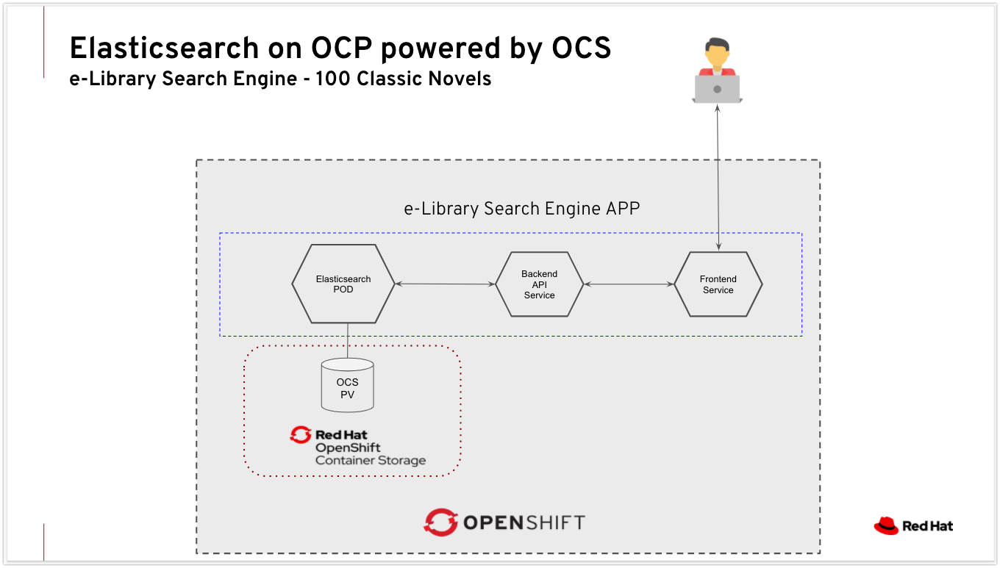

# A Full-Text Search Example App

## Tech Stack
- Elasticsearch - for Text Indexing and Searching 
- OpenShift(Kuberentes) - for Deployment
- OpenShift Container Storage - for Data Persistencey
- Node.js - Backend API
- Vue.js - Frontend

## Introduction

*How does Wikipedia sort though 5+ million articles to find the most relevant one for your research?*

*How does Facebook find the friend who you're looking for (and whose name you've misspelled), across a userbase of 2+ billion people?*

*How does Google search the entire internet for webpages relevant to your vague, typo-filled search query?*

In this tutorial, we'll walk through setting up our own full-text search application.  Our example app will provide a UI and API to search the complete texts of 100 literary classic novels (https://www.gutenberg.org) such as *Peter Pan*, *Frankenstein*, and *Treasure Island*.


## Deployment Architecture




## Deployment Instructions 

Requirement : You should have a running OpenShift (Kubernetes) cluster with OpenShift Contaienr Storage class named "ocs-storagecluster-ceph-rbd" (should work with other SC as well, do the changes as needed)

- Clone this repository
```
git clone https://github.com/ksingh7/e-library-app-on-elasticsearch-ocs-ocp.git
```
- Change director to ``deploy-on-ocp``
- Create a namespace and a Persistent Volume Claim for Elasticsearch
```
oc create -f 1_create_ns_ocs_pvc.yaml
```
- Deploy elasticsearch cluster on OCP using PVC from OCS storage class
```
oc create -f 2_deploy_elasticsearch.yaml
```
- Deploy backend API that should interact with elasticsearch
```
oc create -f 3_deploy_backend_api.yaml
```
- Create a Config Map to set the backend API URL on to Frontend
```
echo "env = {BACKEND_URL: 'http://$(oc get route -n e-library -o=jsonpath="{.items[0]['spec.host']}")'}" > env.js
oc create configmap -n e-library env.js --from-file=env.js
```
- Deploy Frontend application that should interact with backend API
```
oc create -f 4_deploy_frontend_app.yaml
```
- Grab the Frontend APP URL
```
oc get route frontend -n e-library
```
- At this time the search will not produce any result. As there is no data in elasticsearch. Inorder to make it work, we need to add the dataset of 100 classic novels into elasticsearch
- Add 100 Classsic Text Novels to Elasticsearch
```
kubectl exec -it e-library-backend-api -- curl -X POST http://localhost:3000/load_data
```
Note : As soon as we load the dataset into elasticsearch cluster, it will store this data on to OpenShift Container Storage Persistent Volumes. In case of any failure at ES level, OCS will make sure that data is available to the ES new pods.

- Once data is loaded sucessfully, you can search the keywords from the Frontend URL

## Building the Container Images

### For backend
```
cd backend
docker build -t e-library-backend-api:latest .
docker tag e-library-backend-api:latest karansingh/e-library-backend-api:latest
docker push karansingh/e-library-backend-api:latest
```
### For Frontend
```
cd frontend
docker build -t e-library-frontend-ks:latest .
docker tag e-library-frontend:latest karansingh/e-library-frontend:latest
docker push karansingh/e-library-frontend:latest
```
---
This application is 100% open-source, feel free to utilize the code however you would like.
